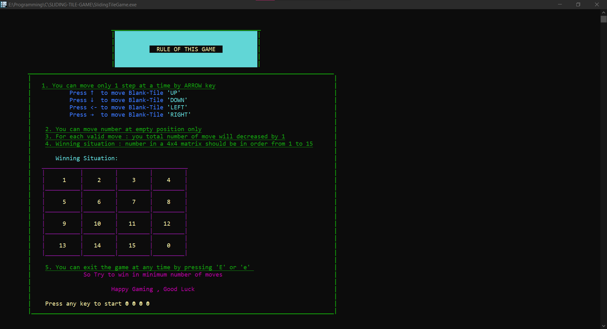

# SLIDING TILE GAME

 Sliding Tiles [4x4] Puzzle Game: Swipe and place the tiles orderly.
 Challenge the number maze quickly.  
 
 

## DESCRIPTION
A sliding puzzle, sliding block puzzle, or sliding tile puzzle is a combination puzzle that challenges a player to slide (frequently flat) pieces along certain routes (usually on a board) to establish a certain end-configuration.
The pieces to be moved may consist of simple shapes, or they may be imprinted with colours, patterns, sections of a larger picture (like a jigsaw puzzle), numbers, or letters.

## QUICK-START
 Run the SlidingTileGame.exe file to play the game.

## BUILD
 ```console
$ gcc SlidingTileGame.c -o SlidingTileGame
```

## HOW-TO-PLAY
 This classic puzzle relies on a 4 × 4 board with 15 numbered tiles and one free space.
 The objective is to slide the tiles until the numbers are in the correct order, going left to right and top to bottom.
 Tiles can only slide, you're not allowed to directly pick them up and rearrange them.

## MOVEMENT-KEYS
|Keys|Description|Blank-Tile: Represented by [0]|
|---|---|---|
|<kbd>↑</kbd>|Move Blank-Tile UP|
|<kbd>↓</kbd>|Move Blank-Tile DOWN|
|<kbd>←</kbd>|Move Blank-Tile LEFT|
|<kbd>→</kbd>|Move Blank-Tile RIGHT|

## REFERENCES
 https://en.wikipedia.org/wiki/Sliding_puzzle
